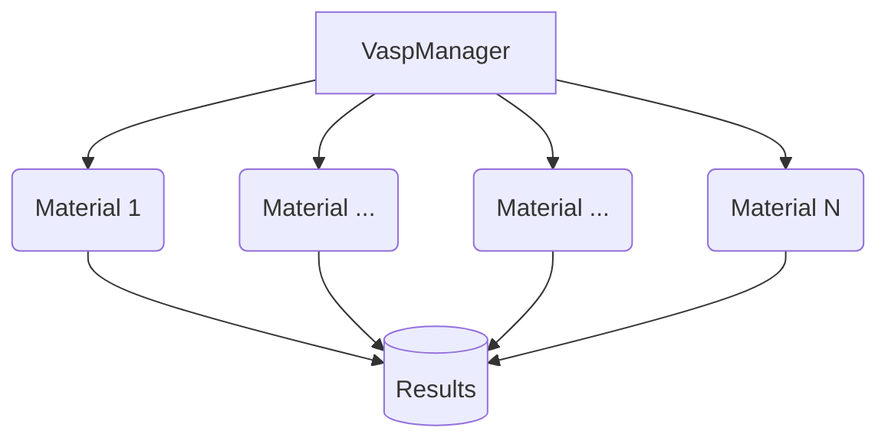

# About vasp-manager

This package serves to automate `VASP` calculations. `VASP` input creation is
automatic, and so is job submission, queue monitoring, calculation analysis, and
storage of the results. Simply rerun the main script and any calculations that
are ready for the next type of calculation will be created and submitted.

## VaspManager

The main class for handling all calculations is [VaspManager][vasp_manager.VaspManager],
which takes in a list of calculation types and material paths. See the class
documentation for more details. By default, results are exported to
`calculations/results.json`.

The bulk moduli analysis is carried out in the backend using the open-source
`pymatgen` software to fit an EOS and elastic constant analysis using custom
scripts.

