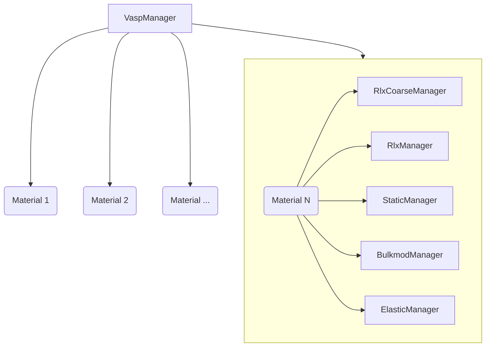
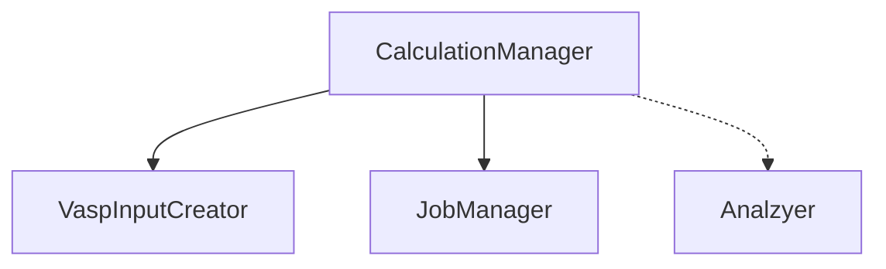

# Managers

VaspManager handles the creation of a set of CalculationManagers for each material
and specified calculation types.

Each CalculationManager has its own logical flow in order to handle VASP input creation,
job submission and monitoring, and result processing.

