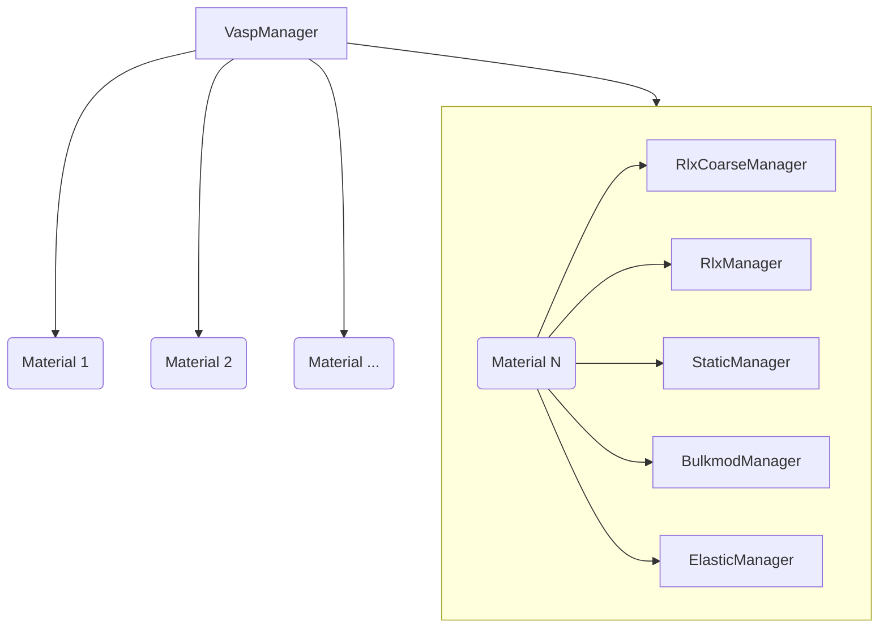
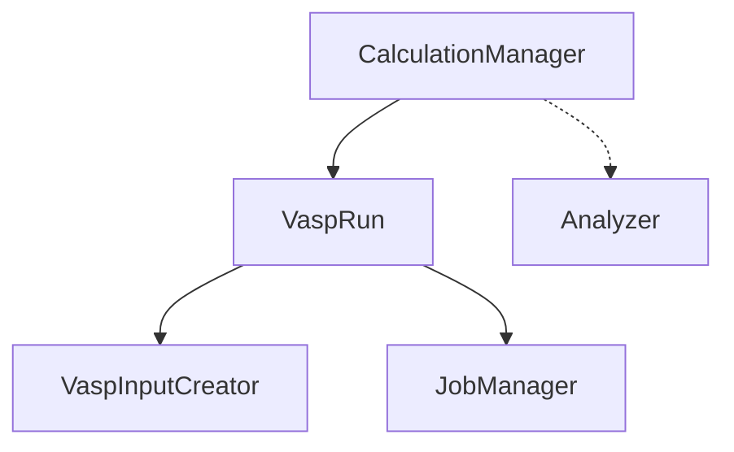
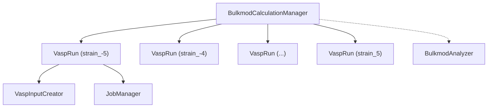

# Managers

VaspManager handles the creation of a set of CalculationManagers for each material
and specified calculation types.

```mermaid
graph TD
A[VaspManager] --> C(Material 1) & D(Material 2) & E(Material ...)
subgraph identifier[" "]
direction LR
  F(Material N) --> G[RlxCoarseManager]
  F --> H[RlxManager]
  F --> I[StaticManager]
  F --> J[BulkmodManager]
  F --> K[ElasticManager]
end
A[VaspManager] --> identifier[" "]
```

## Single-run managers

For single-run calculation types (`rlx-coarse`, `rlx`, `static`, `elastic`), each
CalculationManager owns one [VaspRun][vasp_manager.vasp_run.VaspRun] that wraps
the input creator, job manager, and run-level concerns like error checking.

```mermaid
graph TD
A[CalculationManager] --> V[VaspRun]
V --> B[VaspInputCreator]
V --> C[JobManager]
A -.-> D[Analyzer]
```

## Multi-run managers

[BulkmodCalculationManager][vasp_manager.calculation_manager.bulkmod.BulkmodCalculationManager]
manages multiple independent runs (one per strain). Each strain gets its own
[VaspRun][vasp_manager.vasp_run.VaspRun] with its own
[VaspInputCreator][vasp_manager.vasp_input_creator.VaspInputCreator] and
[JobManager][vasp_manager.job_manager.JobManager], allowing strains to be submitted
and monitored independently.

```mermaid
graph TD
A[BulkmodCalculationManager] --> V1["VaspRun (strain_-5)"]
A --> V2["VaspRun (strain_-4)"]
A --> VD["VaspRun (...)"]
A --> VN["VaspRun (strain_5)"]
V1 --> B1[VaspInputCreator] & C1[JobManager]
A -.-> D[BulkmodAnalyzer]
```
