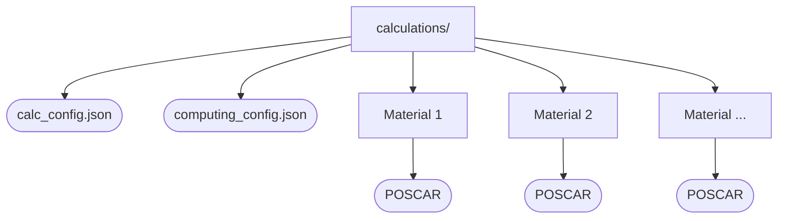

# Setting Up

In order to use this package, you MUST

1. Create a calculations folder where you'd like to run your calculations.
   Each subfolder of `calculations/` should have a unique name and contain a
   `POSCAR`. A sample method of creating the calculations folder from a `json`
   with names and cifs is available in `run_vasp_calculations.py`, and an
   example calculations folder is provided in `calculations/`.
2. Configure [`computing_config.json`](#computing-configuration) and place it
   in the `calculations/` directory.
3. Make any desired modifications to
   [`calc_config.json`](#calculation-configuration) and place it in the
   `calculations/` directory.

When you're done, your calculation directory should look roughly like this:



## Computing Configuration

The computing configuration is set up in `computing_config.json`.

Here, you can configure settings for each supercomputer you would like to use.
Be sure to check that `computer` at the top matches the supercomputer you're
running jobs on.

- As of now, only Perlmutter and Bridges2 at NERSC and QUEST at Northwestern
  University are supported. Any other SLURM based supercomputers can be easily
  added, but modifications could be made for other queue management systems.

### Supported tags

* `user_id` (str)
* `potcar_dir` (str)
* `queuetype` (str)
* `allocation` (str)
* `constraint` (str)
* `vasp_module` (str)
* `ncore` (int)
* `ncore_per_node` (int)

!!! note

    * `potcar_dir` should be a global path to a folder containing VASP POTCARs.
    * `constraint` is only needed for Perlmutter (to specify cpu nodes).
    * `ncore` is NCORE in the VASP INCAR.
    * `ncore_per_node` should be the number of CPUs on each node.
    * For `vasp_module`, a VASP 6 module is strongly recommended.
    * The `personal` "computer" is only used for internal unit testing, not to
      run any actual jobs.

!!! warning "Warning"

    Be sure that your settings of KPAR and NCORE are compatible with the
    computing architecture you're using!

    - It's okay if `ncore * kpar != ncore_per_node`. All cores on the node will
      still be requested, and some of them will be left empty for extra memory.
      This can be useful for computing architectures with a weird number of
      cores (e.g. 52 on Quest).

??? example "Example"

    ```title="computing_config.json"
    --8<-- "calculations/computing_config.json"
    ```


## Calculation Configuration

!!! tip "Tip"

    See more about `VASP` INCAR tags [here](https://www.vasp.at/wiki/index.php/INCAR)

The calculation configuration is set up in `calc_config.json`.

For each desired calculation mode, set the INCAR tags in this json.

* Each mode has its own configuration settings with sensible defaults, but these can be easily customized by the user.
* See more about about spin polarization settings (`"ispin": "auto"`) here:
  [Spin Configuration](user_config/spin.md)
* See more about DFT+U settings (`"hubbards": "wang"`) here:
  [DFT+U Configuration](user_config/hubbards.md)
* Note: `VaspManager` uses 1 compute node per 32 atoms, so don't be surprised
  if you job requests more than a single node.

### Supported tags:

* `prec` (`str`): ["Normal" | "Accurate"]
* `ispin` (`str | int`): ["auto" | 1]
* `hubbards` (`str | None`): ["wang" | null]
* `kspacing` (`float`)
* `symprec` (`float`)
* `nsw` (`int`)
* `ibrion` (`int`)
* `isif` (`int`)
* `lreal` (`bool`): [".FALSE.", ".TRUE."]
* `potim` (`float`)
* `ediffg` (`float`)
* `iopt` (`int`)
* `nelm` (`int`)
* `encut` (`float`)
* `ediff` (`float`)
* `algo` (`str`): ["Normal" | "Fast" | "VeryFast"]
* `ismear` (`int`)
* `sigma` (`float`)
* `amix` (`float`)
* `bmix` (`float`)
* `lwave` (`bool`): [".FALSE.", ".TRUE."]
* `lcharge` (`bool`): [".FALSE.", ".TRUE."]
* `lvot` (`bool`): [".FALSE.", ".TRUE."]
* `kpar` (`int`)
* `gga` (`str`)
* `walltime` (`str`)

!!! note "Note"

    * In `json` files, the equivalent of python's `None` is `null`.
    * `VASP` (Fortran) expects `bool` data to be passed as `".FALSE."` or
      `".TRUE."`.
    * I prefer to write small floats (e.g. `"1e-03"`) as a string to prevent
      them from being parsed as decimals (e.g. `0.001`).
    * `walltime` should be passed as `"hh:mm:ss"`. You should try to set this
      such that your job hits NSW before it runs out of time.  If your job
      fails or times out, an archive will be made and the calculation will be
      resubmitted with a (2x) longer walltime.
    * You can place another `calc_config.json` file in a specific material's calculation
      directory (e.g. `NaCl/rlx`) to use custom settings for only that
      material. You only need to include settings you want to change from the
      main `calc_config.json`.

??? example "Example"

    ```title="calc_config.json"
    --8<-- "calculations/calc_config.json"
    ```
